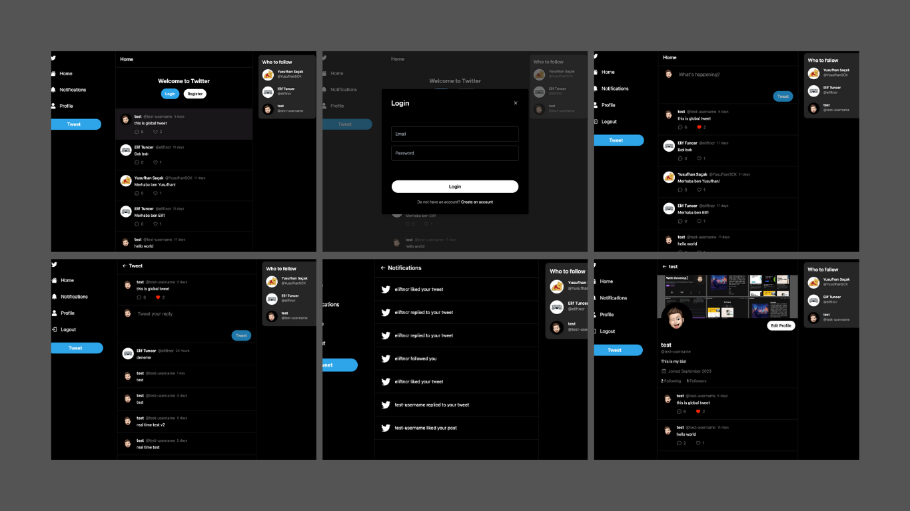

# Twitter Clone



Live Demo: <https://twitter-clone-lilac-rho.vercel.app/>

## Overview

This project is a Twitter clone built with Next.js, a popular React framework. It allows users to create, read, and interact with tweets, just like the real Twitter. Here's a brief guide to get you started with this project.

## Getting Started

```
git clone https://github.com/JosephDoUrden/twitter-clone.git
cd twitter-clone
npm run dev
```

### Environment Variables

Create a `.env` file in the root directory of the project. Add the following environment variables to the file.

```
DATABASE_URL="mongodb+srv://<username>:<password>@twitter-clone.6vg2ryl.mongodb.net/test?retryWrites=true&w=majority"
NEXTAUTH_JWT_SECRET="NEXT_AUTH_JWT_SECRET"
NEXTAUTH_SECRET="NEXT_AUTH_SECRET"
```

## Features

- [x] Create a tweet
- [x] Read tweets
- [x] Like a tweet
- [x] Reply to a tweet
- [x] Delete a tweet
- [x] Follow a user
- [x] Unfollow a user
- [x] View user profile
- [x] View user tweets

## Contact

If you have any questions, feedback, or would like to connect, feel free to reach out to me.

- **Name:** Yusufhan Sacak
- **Email:** [yusufhan.sacak@bahcesehir.edu.tr](mailto:yusufhan.sacak@bahcesehir.edu.tr)
- **Medium:** [My Medium Profile](https://medium.com/@yusufhansacak)
- **Twitter:** [@0xSCK](https://twitter.com/0xSCK)
- **LinkedIn:** [Yusufhan Saçak](https://www.linkedin.com/in/yusufhansacak/)
- **Website:** [yusufhan.dev](https://yusufhan.dev/)

Feel free to contact me through any of the channels above. I'm open to collaborations and discussions related to Flutter development or any other projects.